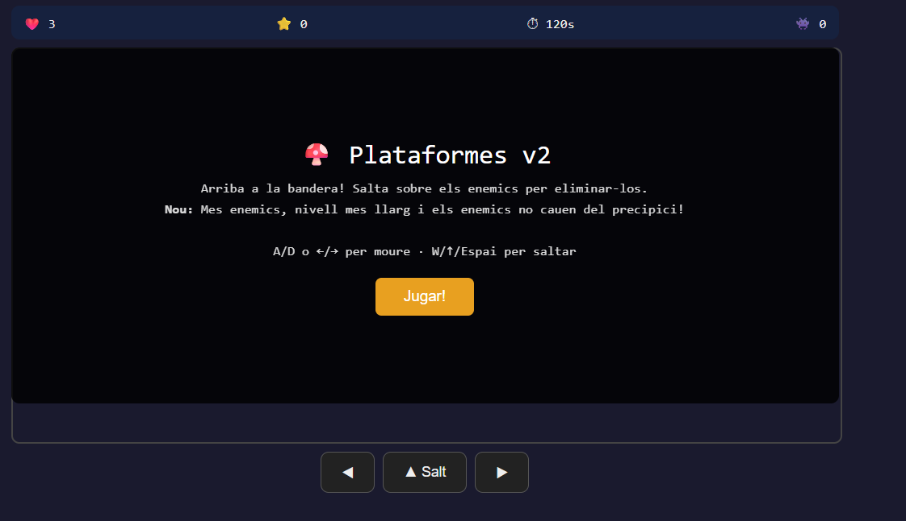
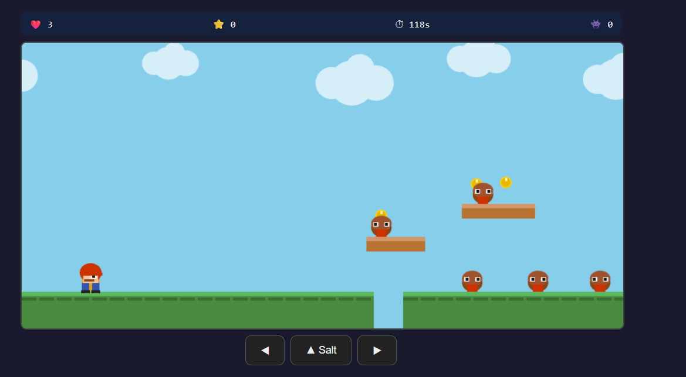
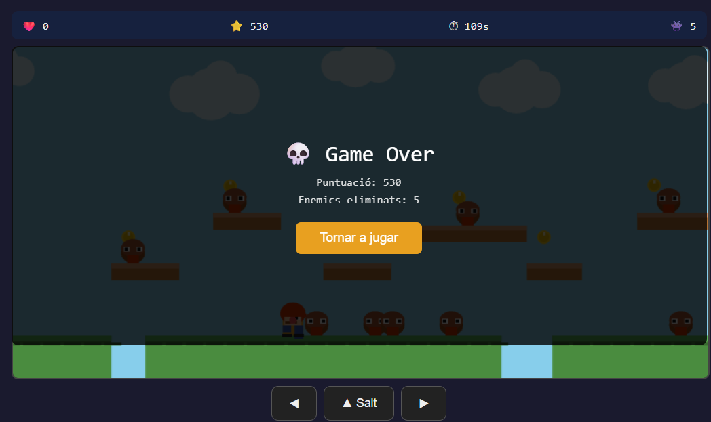

# Fase 3 - Entorn i prototip

## Informació general del projecte

En aquesta fase s’ha preparat l’entorn de desenvolupament del videojoc tipus plataformes inspirat en Mario. També s’ha desenvolupat un primer prototip funcional executable dins del repositori.

L’objectiu principal ha estat validar que el joc arrenca correctament, disposa d’interacció amb l’usuari i incorpora un bucle de joc operatiu.

---

## IDE utilitzat i configuració bàsica

S’ha utilitzat **Visual Studio Code** com a entorn de desenvolupament principal.

### Configuració aplicada

- Suport per HTML, CSS i JavaScript  
- Live Server per proves locals  
- Git integrat  
- Organització per carpetes  
- Navegador web per execució del joc

---

## Decisions inicials d’implementació

### Tecnologies utilitzades

- HTML5  
- CSS3  
- JavaScript  
- Canvas API

### Mecàniques implementades

- Moviment lateral  
- Salt  
- Gravetat  
- Plataformes  
- Col·lisions  
- Pantalla inicial  
- Pantalla de victòria i derrota  
- Reinici de partida  
- Bucle principal del joc

---

## Evidències visuals

### Captures de l’IDE en funcionament

---

## Codi

### Prototip executable pujat al repositori

Fitxer principal:

[Fitxer principal del joc](mario/mario_platformer_game.html)
