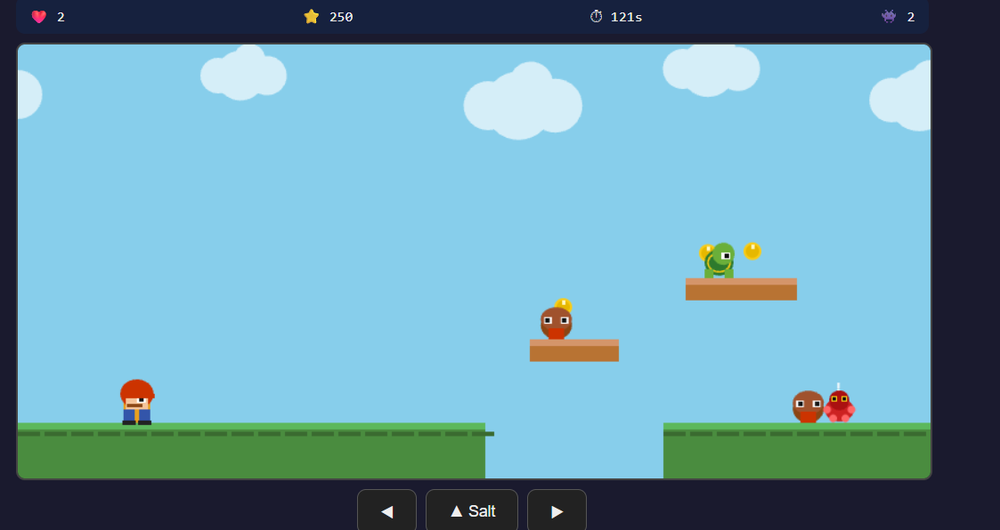
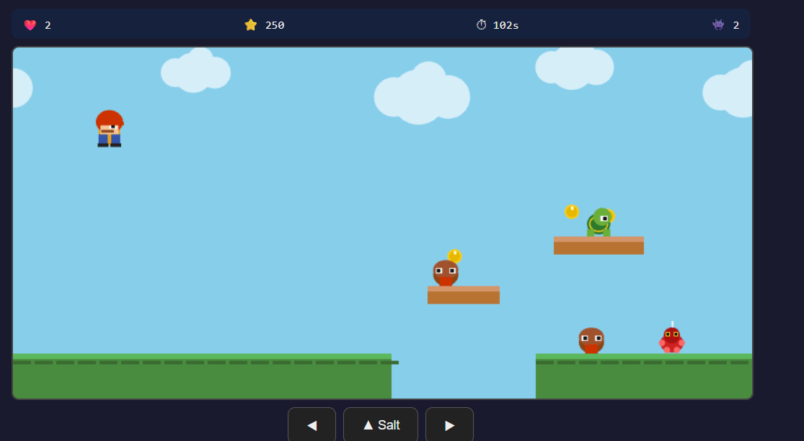
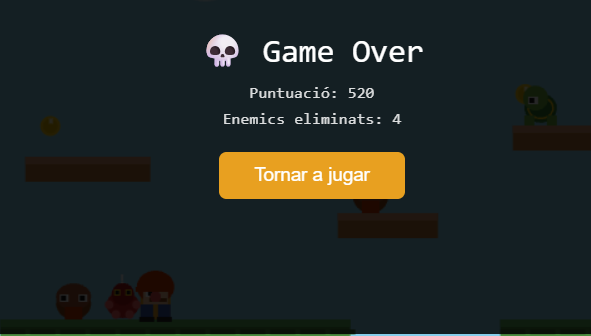
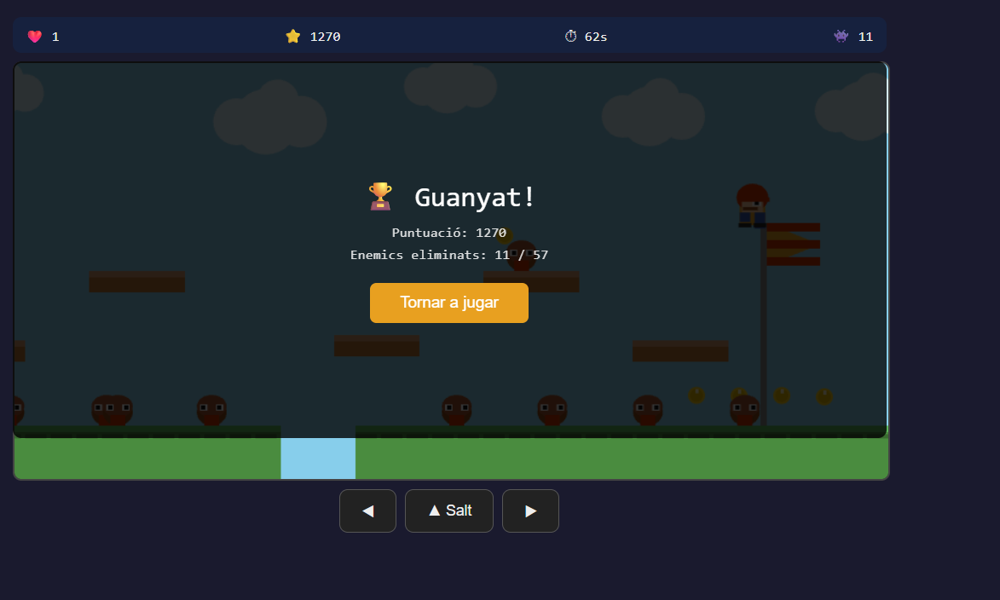

# 04_proves_i_depuracio.md

# 1. Casos de prova

## Prova 1 — Moviment del jugador

**Objectiu:**  
Comprovar que el jugador es mou correctament cap a l'esquerra i la dreta.

**Entrada:**  
Prémer tecla A i després tecla D.

**Resultat esperat:**  
- Amb A el jugador es mou a l'esquerra.
- Amb D el jugador es mou a la dreta.

**Resultat obtingut:**  
El jugador es mou correctament en les dues direccions.

---



## Prova 2 — Salt del jugador

**Objectiu:**  
Comprovar el funcionament del salt i la gravetat.

**Entrada:**  
Prémer barra espaiadora.

**Resultat esperat:**  
El jugador puja i posteriorment baixa aplicant gravetat.

**Resultat obtingut:**  
El salt funciona correctament i el personatge torna al terra.

---


## Prova 3 — Col·lisió amb enemics

**Objectiu:**  
Comprovar que el jugador perd vida en tocar un enemic lateralment.

**Entrada:**  
Moure el jugador contra un enemic.

**Resultat esperat:**  
La vida disminueix en 1.

**Resultat obtingut:**  
La vida disminueix correctament.

---



## Prova 4 — Eliminació d’enemics

**Objectiu:**  
Comprovar que el jugador elimina un enemic si hi salta a sobre.

**Entrada:**  
Saltar damunt d’un enemic.

**Resultat esperat:**  
- L’enemic desapareix
- La puntuació augmenta

**Resultat obtingut:**  
L’enemic desapareix i s’afegeixen punts.

---


## Prova 5 — Condició de victòria

**Objectiu:**  
Comprovar que el jugador guanya en arribar a la meta.

**Entrada:**  
Arribar a la posició final del mapa.

**Resultat esperat:**  
El joc mostra estat "GUANYAT".

**Resultat obtingut:**  
La pantalla de victòria apareix correctament.

---



# 2. Resultats de les proves executades

| Prova | Estat |
|---------|--------|
| Moviment | Correcte |
| Salt | Correcte |
| Col·lisions | Correcte |
| Eliminació enemics | Correcte |
| Meta | Correcte |

---

# 3. Incidències detectades

## Incidència 1

**Descripció:**  
El jugador podia saltar infinitament.

**Causa probable:**  
No es comprovava si el jugador estava tocant el terra abans de permetre un nou salt.

**Solució aplicada:**  
Afegir una variable `estaSaltant` i comprovar col·lisió amb terra.

---

## Incidència 2

**Descripció:**  
Alguns enemics travessaven blocs.

**Causa probable:**  
Error en la detecció de col·lisions.

**Solució aplicada:**  
Implementació de col·lisions rectangulars (AABB).

---

# 4. Evidència de depuració

Exemple de logs utilitzats:

```javascript
console.log("Posició jugador:", player.x, player.y);

console.log("Vida:", player.life);

console.log("Col·lisió detectada");

console.log("Enemic eliminat");

console.log("Puntuació:", player.score);
