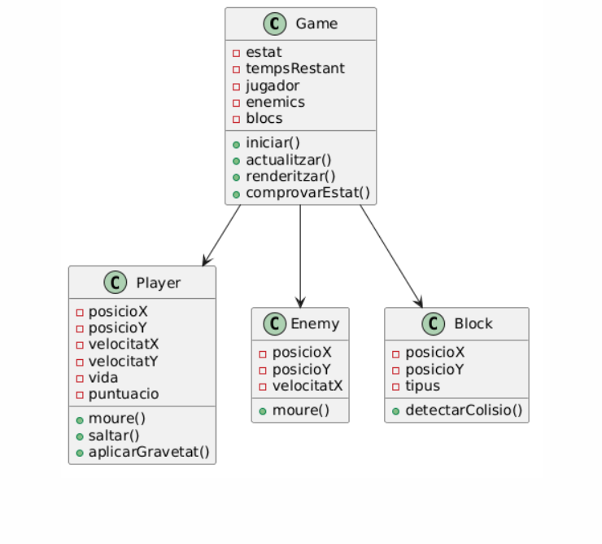
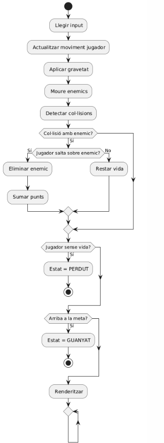

# 02_model_del_joc.md

## Components principals del joc
Els components principals del sistema són:

- **Motor del joc (Game Engine)**: controla el bucle de joc i la lògica general.
- **Renderitzat**: s’encarrega de dibuixar els elements a pantalla.
- **Input**: gestiona les entrades del jugador (teclat).
- **Lògica del joc**: gestiona regles, col·lisions i estats.

---

## 2. Entitats identificades
Les entitats principals del joc són:

- Jugador  
- Enemic  
- Bloc  
- Joc (Game)  

---

## 3. Atributs clau de cada entitat

### Jugador
- posicioX  
- posicioY  
- velocitatX  
- velocitatY  
- vida  
- puntuacio  
- estaSaltant  

### Enemic
- posicioX  
- posicioY  
- velocitatX  
- actiu  

### Bloc
- posicioX  
- posicioY  
- tipus (normal, vida, terra)  
- actiu  

### Joc (Game)
- estat (jugant, guanyat, perdut)  
- tempsRestant  
- jugador  
- llistaEnemics  
- llistaBlocs  

---

## 4. Accions, mètodes o funcions principals

### Jugador
- moure()  
- saltar()  
- aplicarGravetat()  
- detectarColisio()  

### Enemic
- moure()  
- actualitzar()  

### Bloc
- detectarColisio()  

### Joc (Game)
- iniciar()  
- actualitzar()  
- renderitzar()  
- comprovarEstat()  

---

## 5. Explicació del diagrama de classes

El diagrama de classes representa l’estructura del joc.

- La classe **Joc** és la principal i conté totes les altres entitats.  
- El **Jugador** i els **Enemics** interactuen entre si mitjançant col·lisions.  
- Els **Blocs** defineixen el terreny i elements del mapa.  

Aquest disseny permet separar responsabilitats i facilitar la implementació.

---

## Explicació del diagrama de comportament

El diagrama de comportament representa el bucle de joc.

### Flux:
1. Llegir input  
2. Actualitzar jugador  
3. Aplicar física  
4. Moure enemics  
5. Detectar col·lisions  
6. Comprovar estat del joc  
7. Renderitzar  
8. Repetir  

Aquest flux reflecteix exactament el funcionament del joc en temps real.

---

## Correspondència entre diagrames i codi futur

- Cada entitat serà una classe en JavaScript:
  - Player.js  
  - Enemy.js  
  - Block.js  
  - Game.js  

- Els mètodes definits es convertiran en funcions dins de cada classe.  
- El bucle de joc es traduirà en una funció `gameLoop()` amb `requestAnimationFrame`.

---

## Estructura inicial del repositori

/projecte-joc
│── index.html
│── style.css
│── /src
│ │── Game.js
│ │── Player.js
│ │── Enemy.js
│ │── Block.js
│── /assets
│── /diagramas
│ │── diagrama de classes.png
│ │── Diagrama de comportament.png
│── README.md

---

## Primer commit i README inicial

### Primer commit
- Creació de l’estructura del projecte  
- Afegir fitxers base (HTML, CSS, JS)  
- Afegir carpeta de diagrames  

### README inicial
**Contingut:**
- Nom del projecte  
- Descripció del joc  
- Tecnologies utilitzades  
- Objectiu del projecte  
- Autor  

---

## ✔ Validació

- ✔ Coherent amb fase 1  
- ✔ Preparat per implementar  
- ✔ Classes útils (no decoratives)  
- ✔ Bucle reflectit  
- ✔ Estructura realista 
